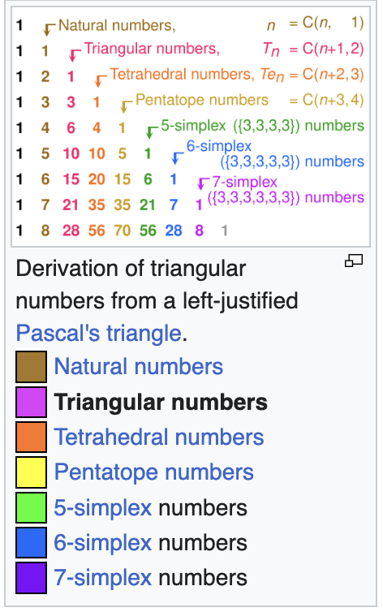

# Demo script for simplex (triangular) numbers in Python

You want to look at the [`tr-nums`](./tr-nums) Python script.
It has two ways to run:

- `tr-nums [-h]` for a continuous list (try piping to `head`)
- `tr-nums -T` runs the unit tests (doctests)

## What is this about?

The ["Triangular numbers"](https://en.wikipedia.org/wiki/Triangular_number
"One of Pascal's secrets to success") article from Wikipedia is a good
introduction to the subject.
Triangular numbers are a common special case of the larger area of _simplex
numbers_.
The article has many good or even beautiful illustrations such as the one
shown on the side.

This script infinitely generates the **inverses** (reciprocals) of the
triangular or simplex numbers.
The inverses have interesting properties including that the sum of all
triangular number reciprocals is **2** making them easier to work with in
infinite series than the standard non-inverse form.

The script follows several good practices for Python as command-line including
command-line option handling.
See the `-h` option for usage.

## Coverage

Present code coverage is **100%** via my favorite Python test library,
[`doctest`](https://docs.python.org/3/library/doctest.html
"Your dessert topping and floor wax: document example usage that doubles as test cases"),
and the excellent [`coverage`](https://coverage.readthedocs.io/
"Sleep better at night knowing that you didn't forget to test something")
library.

I don't have a convenient way to plug in Python test coverage as a badge or to
fail the build if coverage drops, at least not as how I'm used to with xUnit
XML files from JVM projects, and this is an area for me to research if only to
scratch an itch.

In the meanwhile, if this interests you, you can open any [CI workflow
run](https://github.com/binkley/publishing-pipeline/actions
"The Actions tab on repo page") (drill into the run), and at the bottom will
be an "artifact" of a ZIP with the full HTML coverage report.
